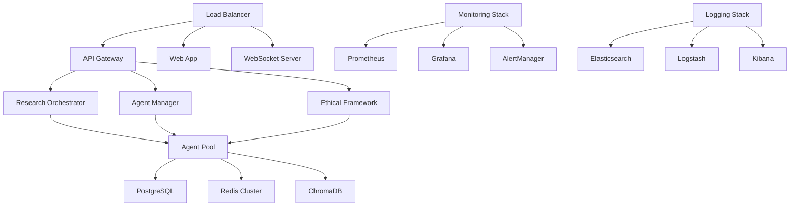

# System Administration Guide

## Overview

This comprehensive guide provides system administrators with the knowledge and tools needed to effectively manage, monitor, and maintain the AI-Scientist-v2 multi-agent system in production environments. Covers deployment, scaling, security, monitoring, and troubleshooting.

## Table of Contents

1. [System Architecture](#system-architecture)
2. [Installation and Deployment](#installation-and-deployment)
3. [Service Management](#service-management)
4. [Database Administration](#database-administration)
5. [Security Management](#security-management)
6. [Monitoring and Alerting](#monitoring-and-alerting)
7. [Backup and Recovery](#backup-and-recovery)
8. [Performance Tuning](#performance-tuning)
9. [Scaling and Load Balancing](#scaling-and-load-balancing)
10. [Troubleshooting](#troubleshooting)
11. [Maintenance Procedures](#maintenance-procedures)

## System Architecture

### Production Architecture Overview

```
┌─────────────────────────────────────────────────────────────┐
│                     Load Balancer                           │
│                    (Nginx/HAProxy)                         │
├─────────────────────────────────────────────────────────────┤
│  ┌─────────────┐  ┌─────────────┐  ┌─────────────────────┐  │
│  │   Web App   │  │   API       │  │   WebSocket         │  │
│  │   Servers   │  │   Gateway   │  │   Servers           │  │
│  └─────────────┘  └─────────────┘  └─────────────────────┘  │
├─────────────────────────────────────────────────────────────┤
│                Multi-Agent System                           │
│  ┌─────────────┐  ┌─────────────┐  ┌─────────────────────┐  │
│  │ Agent Pool  │  │ Research    │  │   Ethical           │  │
│  │ (Docker)    │  │ Orchestrator│  │   Framework        │  │
│  └─────────────┘  └─────────────┘  └─────────────────────┘  │
├─────────────────────────────────────────────────────────────┤
│  ┌─────────────┐  ┌─────────────┐  ┌─────────────────────┐  │
│  │ PostgreSQL  │  │   Redis     │  │   Vector Database   │  │
│  │ (Primary)   │  │   Cluster   │  │   (ChromaDB)        │  │
│  └─────────────┘  └─────────────┘  └─────────────────────┘  │
├─────────────────────────────────────────────────────────────┤
│  ┌─────────────┐  ┌─────────────┐  ┌─────────────────────┐  │
│  │   Monitoring│  │   Logging   │  │   Backup Storage    │  │
│  │ (Prometheus)│  │ (ELK Stack) │  │   (S3/NFS)          │  │
│  └─────────────┘  └─────────────┘  └─────────────────────┘  │
└─────────────────────────────────────────────────────────────┘
```

### Component Interactions



## Installation and Deployment

### System Requirements

#### Minimum Production Requirements

```yaml
# Minimum specifications for small deployment
compute:
  cpu_cores: 16
  memory_gb: 64
  storage_gb: 500

network:
  bandwidth_mbps: 1000
  open_ports: [80, 443, 8080-8090]

database:
  postgresql_version: "14+"
  redis_version: "6+"
  storage_performance: "SSD"

security:
  tls_version: "1.3"
  encryption: "AES-256"
  firewall: "enabled"
```

#### Recommended Production Requirements

```yaml
# Recommended specifications for large deployment
compute:
  cpu_cores: 64
  memory_gb: 256
  storage_gb: 2000

network:
  bandwidth_mbps: 10000
  redundancy: "multi-homed"
  load_balancer: "HAProxy/NGINX Plus"

database:
  postgresql_version: "15+"
  configuration: "clustered"
  replication: "streaming"
  backup: "continuous"

monitoring:
  metrics: "Prometheus + Grafana"
  logging: "ELK Stack"
  tracing: "Jaeger"
  alerting: "AlertManager"

high_availability:
  application: "multi-zone"
  database: "primary-replica"
  load_balancer: "active-passive"
  disaster_recovery: "enabled"
```

### Docker Deployment

#### Docker Compose Production

```yaml
# docker-compose.prod.yml
version: '3.8'

services:
  # Load Balancer
  nginx:
    image: nginx:alpine
    ports:
      - "80:80"
      - "443:443"
    volumes:
      - ./nginx/nginx.conf:/etc/nginx/nginx.conf
      - ./nginx/ssl:/etc/nginx/ssl
      - ./logs/nginx:/var/log/nginx
    depends_on:
      - api-gateway
      - web-app
    restart: unless-stopped
    deploy:
      replicas: 2
      resources:
        limits:
          cpus: '1.0'
          memory: 1G

  # API Gateway
  api-gateway:
    build:
      context: .
      dockerfile: Dockerfile.api
    ports:
      - "8081:8081"
    environment:
      - DATABASE_URL=${DATABASE_URL}
      - REDIS_URL=${REDIS_URL}
      - JWT_SECRET=${JWT_SECRET}
      - ENVIRONMENT=production
    volumes:
      - ./logs/api:/app/logs
    depends_on:
      - postgres
      - redis
    restart: unless-stopped
    deploy:
      replicas: 3
      resources:
        limits:
          cpus: '2.0'
          memory: 4G
      update_config:
        parallelism: 1
        delay: 10s
        order: start-first

  # Web Application
  web-app:
    build:
      context: .
      dockerfile: Dockerfile.web
    ports:
      - "8080:8080"
    environment:
      - DATABASE_URL=${DATABASE_URL}
      - REDIS_URL=${REDIS_URL}
      - ENVIRONMENT=production
    volumes:
      - ./logs/web:/app/logs
      - ./static:/app/static
    depends_on:
      - postgres
      - redis
    restart: unless-stopped
    deploy:
      replicas: 2
      resources:
        limits:
          cpus: '1.5'
          memory: 2G

  # Agent Services
  agent-service:
    build:
      context: .
      dockerfile: Dockerfile.agent
    environment:
      - DATABASE_URL=${DATABASE_URL}
      - REDIS_URL=${REDIS_URL}
      - OPENROUTER_API_KEY=${OPENROUTER_API_KEY}
    volumes:
      - ./logs/agents:/app/logs
      - ./agent_data:/app/data
    depends_on:
      - postgres
      - redis
    restart: unless-stopped
    deploy:
      replicas: 5
      resources:
        limits:
          cpus: '4.0'
          memory: 8G
      placement:
        constraints:
          - node.role == worker

  # Research Orchestrator
  research-orchestrator:
    build:
      context: .
      dockerfile: Dockerfile.orchestrator
    environment:
      - DATABASE_URL=${DATABASE_URL}
      - REDIS_URL=${REDIS_URL}
      - ENVIRONMENT=production
    volumes:
      - ./logs/orchestrator:/app/logs
      - ./research_data:/app/data
    depends_on:
      - postgres
      - redis
    restart: unless-stopped
    deploy:
      replicas: 2
      resources:
        limits:
          cpus: '2.0'
          memory: 4G

  # Database Services
  postgres:
    image: postgres:15
    environment:
      - POSTGRES_DB=${POSTGRES_DB}
      - POSTGRES_USER=${POSTGRES_USER}
      - POSTGRES_PASSWORD=${POSTGRES_PASSWORD}
      - POSTGRES_REPLICATION_USER=${POSTGRES_REPLICATION_USER}
      - POSTGRES_REPLICATION_PASSWORD=${POSTGRES_REPLICATION_PASSWORD}
    volumes:
      - postgres_data:/var/lib/postgresql/data
      - ./database/init.sql:/docker-entrypoint-initdb.d/init.sql
      - ./database/postgresql.conf:/etc/postgresql/postgresql.conf
      - ./database/pg_hba.conf:/etc/postgresql/pg_hba.conf
    ports:
      - "5432:5432"
    restart: unless-stopped
    deploy:
      replicas: 1
      resources:
        limits:
          cpus: '4.0'
          memory: 8G

  postgres-replica:
    image: postgres:15
    environment:
      - PGUSER=${POSTGRES_USER}
      - POSTGRES_PASSWORD=${POSTGRES_PASSWORD}
      - POSTGRES_MASTER_SERVICE=postgres
      - POSTGRES_REPLICATION_USER=${POSTGRES_REPLICATION_USER}
      - POSTGRES_REPLICATION_PASSWORD=${POSTGRES_REPLICATION_PASSWORD}
    volumes:
      - postgres_replica_data:/var/lib/postgresql/data
    depends_on:
      - postgres
    restart: unless-stopped
    deploy:
      replicas: 1
      resources:
        limits:
          cpus: '2.0'
          memory: 4G

  # Redis Cluster
  redis-master:
    image: redis:7-alpine
    command: redis-server --appendonly yes --replica-read-only no
    volumes:
      - redis_master_data:/data
      - ./redis/redis.conf:/etc/redis/redis.conf
    ports:
      - "6379:6379"
    restart: unless-stopped
    deploy:
      replicas: 1
      resources:
        limits:
          cpus: '1.0'
          memory: 2G

  redis-replica:
    image: redis:7-alpine
    command: redis-server --slaveof redis-master 6379 --appendonly yes
    volumes:
      - redis_replica_data:/data
    depends_on:
      - redis-master
    restart: unless-stopped
    deploy:
      replicas: 2
      resources:
        limits:
          cpus: '0.5'
          memory: 1G

  # Vector Database
  chromadb:
    image: chromadb/chroma:latest
    ports:
      - "8000:8000"
    environment:
      - CHROMA_SERVER_HOST=0.0.0.0
      - CHROMA_SERVER_HTTP_PORT=8000
      - CHROMA_LOG_LEVEL=INFO
    volumes:
      - chromadb_data:/chroma/chroma
    restart: unless-stopped
    deploy:
      replicas: 1
      resources:
        limits:
          cpus: '2.0'
          memory: 4G

  # Monitoring Stack
  prometheus:
    image: prom/prometheus:latest
    ports:
      - "9090:9090"
    volumes:
      - ./monitoring/prometheus.yml:/etc/prometheus/prometheus.yml
      - ./monitoring/rules:/etc/prometheus/rules
      - prometheus_data:/prometheus
    command:
      - '--config.file=/etc/prometheus/prometheus.yml'
      - '--storage.tsdb.path=/prometheus'
      - '--web.console.libraries=/etc/prometheus/console_libraries'
      - '--web.console.templates=/etc/prometheus/consoles'
      - '--storage.tsdb.retention.time=30d'
      - '--web.enable-lifecycle'
    restart: unless-stopped

  grafana:
    image: grafana/grafana:latest
    ports:
      - "3000:3000"
    environment:
      - GF_SECURITY_ADMIN_PASSWORD=${GRAFANA_PASSWORD}
      - GF_USERS_ALLOW_SIGN_UP=false
    volumes:
      - grafana_data:/var/lib/grafana
      - ./monitoring/grafana/dashboards:/etc/grafana/provisioning/dashboards
      - ./monitoring/grafana/datasources:/etc/grafana/provisioning/datasources
    depends_on:
      - prometheus
    restart: unless-stopped

  alertmanager:
    image: prom/alertmanager:latest
    ports:
      - "9093:9093"
    volumes:
      - ./monitoring/alertmanager.yml:/etc/alertmanager/alertmanager.yml
      - alertmanager_data:/alertmanager
    command:
      - '--config.file=/etc/alertmanager/alertmanager.yml'
      - '--storage.path=/alertmanager'
    restart: unless-stopped

  # Logging Stack
  elasticsearch:
    image: docker.elastic.co/elasticsearch/elasticsearch:8.5.0
    environment:
      - discovery.type=single-node
      - "ES_JAVA_OPTS=-Xms2g -Xmx2g"
      - xpack.security.enabled=false
    volumes:
      - elasticsearch_data:/usr/share/elasticsearch/data
    ports:
      - "9200:9200"
    restart: unless-stopped
    deploy:
      resources:
        limits:
          cpus: '2.0'
          memory: 4G

  logstash:
    image: docker.elastic.co/logstash/logstash:8.5.0
    volumes:
      - ./logging/logstash.conf:/usr/share/logstash/pipeline/logstash.conf
      - ./logs:/var/log/app
    ports:
      - "5044:5044"
    depends_on:
      - elasticsearch
    restart: unless-stopped

  kibana:
    image: docker.elastic.co/kibana/kibana:8.5.0
    ports:
      - "5601:5601"
    environment:
      - ELASTICSEARCH_HOSTS=http://elasticsearch:9200
    depends_on:
      - elasticsearch
    restart: unless-stopped

volumes:
  postgres_data:
  postgres_replica_data:
  redis_master_data:
  redis_replica_data:
  chromadb_data:
  prometheus_data:
  grafana_data:
  alertmanager_data:
  elasticsearch_data:

networks:
  default:
    driver: bridge
    ipam:
      config:
        - subnet: 172.20.0.0/16
```

#### Deployment Script

```bash
#!/bin/bash
# scripts/deploy_production.sh

set -e

# Configuration
ENVIRONMENT="production"
COMPOSE_FILE="docker-compose.prod.yml"
BACKUP_DIR="/backup/$(date +%Y%m%d_%H%M%S)"

echo "Starting production deployment..."

# Pre-deployment checks
echo "Running pre-deployment checks..."
./scripts/pre_deployment_checks.sh

# Create backup
echo "Creating backup..."
mkdir -p $BACKUP_DIR
docker-compose -f $COMPOSE_FILE exec postgres pg_dump -U $POSTGRES_USER $POSTGRES_DB > $BACKUP_DIR/database.sql

# Pull latest images
echo "Pulling latest images..."
docker-compose -f $COMPOSE_FILE pull

# Deploy with zero downtime
echo "Starting rolling deployment..."

# Update API Gateway
docker-compose -f $COMPOSE_FILE up -d --no-deps api-gateway
sleep 30

# Update Web App
docker-compose -f $COMPOSE_FILE up -d --no-deps web-app
sleep 30

# Update Agent Services (rolling update)
docker-compose -f $COMPOSE_FILE up -d --no-deps --scale agent-service=6 agent-service
sleep 60

# Update Research Orchestrator
docker-compose -f $COMPOSE_FILE up -d --no-deps research-orchestrator
sleep 30

# Health checks
echo "Running health checks..."
./scripts/health_checks.sh

# Post-deployment verification
echo "Running post-deployment verification..."
./scripts/post_deployment_verification.sh

echo "Production deployment completed successfully!"
echo "Backup created at: $BACKUP_DIR"
```

## Service Management

### Systemd Service Files

#### API Gateway Service

```ini
# /etc/systemd/system/ai-scientist-api-gateway.service
[Unit]
Description=AI Scientist API Gateway
Requires=docker.service
After=docker.service
Wants=network-online.target
After=network-online.target

[Service]
Type=oneshot
RemainAfterExit=yes
WorkingDirectory=/opt/ai-scientist
ExecStart=/usr/bin/docker-compose -f docker-compose.prod.yml up -d api-gateway
ExecStop=/usr/bin/docker-compose -f docker-compose.prod.yml stop api-gateway
ExecReload=/usr/bin/docker-compose -f docker-compose.prod.yml restart api-gateway
TimeoutStartSec=300
TimeoutStopSec=60
Restart=on-failure
RestartSec=10

[Install]
WantedBy=multi-user.target
```

#### Monitoring Service

```ini
# /etc/systemd/system/ai-scientist-monitoring.service
[Unit]
Description=AI Scientist Monitoring Stack
Requires=docker.service
After=docker.service

[Service]
Type=oneshot
RemainAfterExit=yes
WorkingDirectory=/opt/ai-scientist
ExecStart=/usr/bin/docker-compose -f docker-compose.monitoring.yml up -d
ExecStop=/usr/bin/docker-compose -f docker-compose.monitoring.yml down
TimeoutStartSec=300
TimeoutStopSec=60
Restart=on-failure
RestartSec=10

[Install]
WantedBy=multi-user.target
```

### Service Management Scripts

```bash
#!/bin/bash
# scripts/manage_services.sh

# Service management functions
start_service() {
    local service=$1
    echo "Starting $service..."
    systemctl start ai-scientist-$service.service
    systemctl enable ai-scientist-$service.service
}

stop_service() {
    local service=$1
    echo "Stopping $service..."
    systemctl stop ai-scientist-$service.service
    systemctl disable ai-scientist-$service.service
}

restart_service() {
    local service=$1
    echo "Restarting $service..."
    systemctl restart ai-scientist-$service.service
}

status_service() {
    local service=$1
    echo "Status of $service:"
    systemctl status ai-scientist-$service.service
}

# Service health checks
check_service_health() {
    local service=$1
    local max_attempts=30
    local attempt=1

    while [ $attempt -le $max_attempts ]; do
        if curl -f http://localhost:8081/health >/dev/null 2>&1; then
            echo "$service is healthy"
            return 0
        fi
        echo "Attempt $attempt: $service not ready yet..."
        sleep 10
        ((attempt++))
    done

    echo "$service health check failed after $max_attempts attempts"
    return 1
}

# Service management
case "$1" in
    start)
        case "$2" in
            api-gateway)
                start_service "api-gateway"
                ;;
            web-app)
                start_service "web-app"
                ;;
            agents)
                start_service "agents"
                ;;
            monitoring)
                start_service "monitoring"
                ;;
            all)
                start_service "api-gateway"
                start_service "web-app"
                start_service "agents"
                start_service "monitoring"
                ;;
            *)
                echo "Usage: $0 start {api-gateway|web-app|agents|monitoring|all}"
                exit 1
                ;;
        esac
        ;;
    stop)
        case "$2" in
            api-gateway)
                stop_service "api-gateway"
                ;;
            web-app)
                stop_service "web-app"
                ;;
            agents)
                stop_service "agents"
                ;;
            monitoring)
                stop_service "monitoring"
                ;;
            all)
                stop_service "api-gateway"
                stop_service "web-app"
                stop_service "agents"
                stop_service "monitoring"
                ;;
            *)
                echo "Usage: $0 stop {api-gateway|web-app|agents|monitoring|all}"
                exit 1
                ;;
        esac
        ;;
    restart)
        case "$2" in
            api-gateway)
                restart_service "api-gateway"
                ;;
            web-app)
                restart_service "web-app"
                ;;
            agents)
                restart_service "agents"
                ;;
            monitoring)
                restart_service "monitoring"
                ;;
            all)
                restart_service "api-gateway"
                restart_service "web-app"
                restart_service "agents"
                restart_service "monitoring"
                ;;
            *)
                echo "Usage: $0 restart {api-gateway|web-app|agents|monitoring|all}"
                exit 1
                ;;
        esac
        ;;
    status)
        case "$2" in
            api-gateway)
                status_service "api-gateway"
                ;;
            web-app)
                status_service "web-app"
                ;;
            agents)
                status_service "agents"
                ;;
            monitoring)
                status_service "monitoring"
                ;;
            all)
                status_service "api-gateway"
                status_service "web-app"
                status_service "agents"
                status_service "monitoring"
                ;;
            *)
                echo "Usage: $0 status {api-gateway|web-app|agents|monitoring|all}"
                exit 1
                ;;
        esac
        ;;
    health)
        case "$2" in
            api-gateway)
                check_service_health "api-gateway"
                ;;
            web-app)
                check_service_health "web-app"
                ;;
            agents)
                check_service_health "agents"
                ;;
            all)
                check_service_health "api-gateway"
                check_service_health "web-app"
                check_service_health "agents"
                ;;
            *)
                echo "Usage: $0 health {api-gateway|web-app|agents|all}"
                exit 1
                ;;
        esac
        ;;
    *)
        echo "Usage: $0 {start|stop|restart|status|health} {api-gateway|web-app|agents|monitoring|all}"
        exit 1
        ;;
esac
```

## Database Administration

### PostgreSQL Configuration

#### Optimized PostgreSQL Configuration

```postgresql
# /etc/postgresql/15/main/postgresql.conf

# Connection Settings
max_connections = 200
superuser_reserved_connections = 3

# Memory Settings
shared_buffers = 4GB          # 25% of RAM
effective_cache_size = 12GB   # 75% of RAM
work_mem = 64MB
maintenance_work_mem = 256MB
autovacuum_work_mem = 256MB

# Checkpoint Settings
checkpoint_completion_target = 0.9
wal_buffers = 16MB
default_statistics_target = 100

# WAL Settings
wal_level = replica
max_wal_size = 4GB
min_wal_size = 1GB
checkpoint_timeout = 15min

# Replication Settings
max_wal_senders = 3
max_replication_slots = 3
wal_keep_size = 512MB

# Logging Settings
log_destination = 'stderr'
logging_collector = on
log_directory = 'log'
log_filename = 'postgresql-%Y-%m-%d_%H%M%S.log'
log_rotation_age = 1d
log_rotation_size = 100MB
log_min_duration_statement = 1000
log_checkpoints = on
log_connections = on
log_disconnections = on
log_lock_waits = on

# Performance Settings
random_page_cost = 1.1
effective_io_concurrency = 200
seq_page_cost = 1.0
cpu_tuple_cost = 0.01
cpu_index_tuple_cost = 0.005
```

#### Database Maintenance Scripts

```bash
#!/bin/bash
# scripts/database_maintenance.sh

# Configuration
DB_HOST="localhost"
DB_PORT="5432"
DB_USER="postgres"
DB_NAME="ai_scientist_prod"
BACKUP_DIR="/backup/database"
RETENTION_DAYS=30

# Backup database
backup_database() {
    local timestamp=$(date +%Y%m%d_%H%M%S)
    local backup_file="$BACKUP_DIR/backup_$timestamp.sql"

    echo "Starting database backup..."

    # Create backup directory if it doesn't exist
    mkdir -p $BACKUP_DIR

    # Perform backup
    pg_dump -h $DB_HOST -p $DB_PORT -U $DB_USER -d $DB_NAME \
        --format=custom \
        --compress=9 \
        --verbose \
        --file=$backup_file

    if [ $? -eq 0 ]; then
        echo "Database backup completed: $backup_file"

        # Verify backup
        pg_restore -h $DB_HOST -p $DB_PORT -U $DB_USER --list $backup_file > /dev/null
        if [ $? -eq 0 ]; then
            echo "Backup verification successful"
        else
            echo "Backup verification failed"
            exit 1
        fi
    else
        echo "Database backup failed"
        exit 1
    fi
}

# Vacuum and analyze database
vacuum_database() {
    echo "Starting database vacuum and analyze..."

    psql -h $DB_HOST -p $DB_PORT -U $DB_USER -d $DB_NAME << EOF
-- Analyze tables to update statistics
ANALYZE VERBOSE;

-- Reindex frequently used tables
REINDEX DATABASE $DB_NAME;

-- Update table statistics
ANALYZE VERBOSE;

EOF

    echo "Database vacuum and analyze completed"
}

# Clean old backups
clean_old_backups() {
    echo "Cleaning old backups..."

    find $BACKUP_DIR -name "backup_*.sql" -mtime +$RETENTION_DAYS -delete

    echo "Old backups cleaned"
}

# Database health check
health_check() {
    echo "Performing database health check..."

    # Check database connectivity
    pg_isready -h $DB_HOST -p $DB_PORT -U $DB_USER
    if [ $? -ne 0 ]; then
        echo "Database is not ready"
        exit 1
    fi

    # Check database size
    db_size=$(psql -h $DB_HOST -p $DB_PORT -U $DB_USER -d $DB_NAME -t -c "SELECT pg_size_pretty(pg_database_size('$DB_NAME'));")
    echo "Database size: $db_size"

    # Check connection count
    conn_count=$(psql -h $DB_HOST -p $DB_PORT -U $DB_USER -d $DB_NAME -t -c "SELECT count(*) FROM pg_stat_activity;")
    echo "Active connections: $conn_count"

    # Check for long-running queries
    long_queries=$(psql -h $DB_HOST -p $DB_PORT -U $DB_USER -d $DB_NAME -t -c "SELECT count(*) FROM pg_stat_activity WHERE state = 'active' AND query_start < now() - interval '5 minutes';")
    if [ $long_queries -gt 0 ]; then
        echo "Warning: $long_queries long-running queries detected"
    fi

    echo "Database health check completed"
}

# Main execution
case "$1" in
    backup)
        backup_database
        ;;
    vacuum)
        vacuum_database
        ;;
    clean)
        clean_old_backups
        ;;
    health)
        health_check
        ;;
    all)
        health_check
        backup_database
        vacuum_database
        clean_old_backups
        ;;
    *)
        echo "Usage: $0 {backup|vacuum|clean|health|all}"
        exit 1
        ;;
esac
```

### Redis Configuration

#### Redis Configuration for Production

```redis
# /etc/redis/redis.conf

# Network Configuration
bind 0.0.0.0
port 6379
timeout 0
tcp-keepalive 300

# Memory Management
maxmemory 2gb
maxmemory-policy allkeys-lru
maxmemory-samples 5

# Persistence
save 900 1
save 300 10
save 60 10000
stop-writes-on-bgsave-error yes
rdbcompression yes
rdbchecksum yes
dbfilename dump.rdb
dir /var/lib/redis

# Replication
replica-serve-stale-data yes
replica-read-only yes
repl-diskless-sync no
repl-diskless-sync-delay 5

# Security
requirepass ${REDIS_PASSWORD}
rename-command FLUSHDB ""
rename-command FLUSHALL ""
rename-command DEBUG ""
rename-command CONFIG "CONFIG-B835C3F8A2F7E6D1"

# Logging
loglevel notice
logfile /var/log/redis/redis-server.log

# Performance
tcp-backlog 511
databases 16
always-show-logo yes
```

## Security Management

### SSL/TLS Configuration

#### Nginx SSL Configuration

```nginx
# nginx/nginx.conf

# SSL Configuration
ssl_protocols TLSv1.2 TLSv1.3;
ssl_prefer_server_ciphers on;
ssl_ciphers ECDHE-ECDSA-AES128-GCM-SHA256:ECDHE-RSA-AES128-GCM-SHA256:ECDHE-ECDSA-AES256-GCM-SHA384:ECDHE-RSA-AES256-GCM-SHA384;
ssl_session_timeout 1d;
ssl_session_cache shared:SSL:50m;
ssl_session_tickets off;

# HSTS (HTTP Strict Transport Security)
add_header Strict-Transport-Security "max-age=63072000; includeSubDomains; preload" always;

# Other security headers
add_header X-Frame-Options DENY always;
add_header X-Content-Type-Options nosniff always;
add_header X-XSS-Protection "1; mode=block" always;
add_header Referrer-Policy "strict-origin-when-cross-origin" always;
add_header Content-Security-Policy "default-src 'self'; script-src 'self' 'unsafe-inline' 'unsafe-eval'; style-src 'self' 'unsafe-inline'; img-src 'self' data: https:; font-src 'self' data:; connect-src 'self' wss:;" always;

# Rate limiting
limit_req_zone $binary_remote_addr zone=api:10m rate=10r/s;
limit_req_zone $binary_remote_addr zone=login:10m rate=1r/s;

server {
    listen 80;
    server_name your-domain.com;
    return 301 https://$server_name$request_uri;
}

server {
    listen 443 ssl http2;
    server_name your-domain.com;

    ssl_certificate /etc/nginx/ssl/cert.pem;
    ssl_certificate_key /etc/nginx/ssl/key.pem;
    ssl_trusted_certificate /etc/nginx/ssl/chain.pem;

    # API endpoints with rate limiting
    location /api/ {
        limit_req zone=api burst=20 nodelay;
        proxy_pass http://api-gateway;
        proxy_set_header Host $host;
        proxy_set_header X-Real-IP $remote_addr;
        proxy_set_header X-Forwarded-For $proxy_add_x_forwarded_for;
        proxy_set_header X-Forwarded-Proto $scheme;
    }

    # Login endpoint with stricter rate limiting
    location /api/auth/login {
        limit_req zone=login burst=5 nodelay;
        proxy_pass http://api-gateway;
        proxy_set_header Host $host;
        proxy_set_header X-Real-IP $remote_addr;
        proxy_set_header X-Forwarded-For $proxy_add_x_forwarded_for;
        proxy_set_header X-Forwarded-Proto $scheme;
    }
}
```

### Firewall Configuration

```bash
#!/bin/bash
# scripts/setup_firewall.sh

# Reset firewall rules
iptables -F
iptables -X
iptables -t nat -F
iptables -t nat -X
iptables -t mangle -F
iptables -t mangle -X

# Set default policies
iptables -P INPUT DROP
iptables -P FORWARD DROP
iptables -P OUTPUT ACCEPT

# Allow loopback traffic
iptables -A INPUT -i lo -j ACCEPT
iptables -A OUTPUT -o lo -j ACCEPT

# Allow established and related connections
iptables -A INPUT -m state --state ESTABLISHED,RELATED -j ACCEPT

# Allow SSH (with rate limiting)
iptables -A INPUT -p tcp --dport 22 -m conntrack --ctstate NEW,ESTABLISHED -m recent --set
iptables -A INPUT -p tcp --dport 22 -m conntrack --ctstate NEW -m recent --update --seconds 60 --hitcount 4 -j DROP
iptables -A INPUT -p tcp --dport 22 -j ACCEPT

# Allow HTTP and HTTPS
iptables -A INPUT -p tcp --dport 80 -j ACCEPT
iptables -A INPUT -p tcp --dport 443 -j ACCEPT

# Allow application ports
iptables -A INPUT -p tcp --dport 8080 -j ACCEPT  # Web App
iptables -A INPUT -p tcp --dport 8081 -j ACCEPT  # API Gateway
iptables -A INPUT -p tcp --dport 8082 -j ACCEPT  # Agent Services

# Allow monitoring ports (restricted to internal network)
iptables -A INPUT -p tcp -s 10.0.0.0/8 --dport 9090 -j ACCEPT  # Prometheus
iptables -A INPUT -p tcp -s 10.0.0.0/8 --dport 3000 -j ACCEPT  # Grafana

# Allow database connections (internal only)
iptables -A INPUT -p tcp -s 10.0.0.0/8 --dport 5432 -j ACCEPT  # PostgreSQL
iptables -A INPUT -p tcp -s 10.0.0.0/8 --dport 6379 -j ACCEPT  # Redis

# Log dropped packets
iptables -A INPUT -j LOG --log-prefix "Dropped: "
iptables -A INPUT -j DROP

# Save rules
iptables-save > /etc/iptables/rules.v4

echo "Firewall configuration completed"
```

## Monitoring and Alerting

### Prometheus Configuration

```yaml
# monitoring/prometheus.yml

global:
  scrape_interval: 15s
  evaluation_interval: 15s

rule_files:
  - "rules/*.yml"

alerting:
  alertmanagers:
    - static_configs:
        - targets:
          - alertmanager:9093

scrape_configs:
  - job_name: 'ai-scientist-api'
    static_configs:
      - targets: ['api-gateway:8081']
    metrics_path: '/metrics'
    scrape_interval: 15s

  - job_name: 'ai-scientist-web'
    static_configs:
      - targets: ['web-app:8080']
    metrics_path: '/metrics'
    scrape_interval: 30s

  - job_name: 'ai-scientist-agents'
    static_configs:
      - targets: ['agent-service:8082']
    metrics_path: '/metrics'
    scrape_interval: 10s

  - job_name: 'postgres'
    static_configs:
      - targets: ['postgres-exporter:9187']

  - job_name: 'redis'
    static_configs:
      - targets: ['redis-exporter:9121']

  - job_name: 'node-exporter'
    static_configs:
      - targets: ['node-exporter:9100']

  - job_name: 'docker'
    static_configs:
      - targets: ['docker-exporter:9323']
```

### Alert Rules

```yaml
# monitoring/rules/ai-scientist.yml

groups:
  - name: ai-scientist.rules
    rules:
      # API Gateway Alerts
      - alert: APIGatewayDown
        expr: up{job="ai-scientist-api"} == 0
        for: 1m
        labels:
          severity: critical
        annotations:
          summary: "API Gateway is down"
          description: "API Gateway has been down for more than 1 minute"

      - alert: APIGatewayHighErrorRate
        expr: rate(http_requests_total{status=~"5.."}[5m]) / rate(http_requests_total[5m]) > 0.05
        for: 5m
        labels:
          severity: warning
        annotations:
          summary: "High error rate in API Gateway"
          description: "API Gateway error rate is {{ $value | humanizePercentage }}"

      - alert: APIGatewayHighLatency
        expr: histogram_quantile(0.95, rate(http_request_duration_seconds_bucket[5m])) > 1
        for: 5m
        labels:
          severity: warning
        annotations:
          summary: "High latency in API Gateway"
          description: "95th percentile latency is {{ $value }}s"

      # Agent Service Alerts
      - alert: AgentServiceDown
        expr: up{job="ai-scientist-agents"} == 0
        for: 1m
        labels:
          severity: critical
        annotations:
          summary: "Agent Service is down"
          description: "Agent Service has been down for more than 1 minute"

      - alert: TooManyFailedAgents
        expr: agent_status{status="error"} > 5
        for: 2m
        labels:
          severity: warning
        annotations:
          summary: "Too many failed agents"
          description: "{{ $value }} agents are in error state"

      # Database Alerts
      - alert: PostgreSQLDown
        expr: up{job="postgres"} == 0
        for: 1m
        labels:
          severity: critical
        annotations:
          summary: "PostgreSQL is down"
          description: "PostgreSQL has been down for more than 1 minute"

      - alert: PostgreSQLTooManyConnections
        expr: pg_stat_activity_count > 150
        for: 5m
        labels:
          severity: warning
        annotations:
          summary: "PostgreSQL has too many connections"
          description: "PostgreSQL has {{ $value }} active connections"

      - alert: PostgreSQLSlowQueries
        expr: rate(pg_stat_statements_mean_time_seconds[5m]) > 1
        for: 5m
        labels:
          severity: warning
        annotations:
          summary: "PostgreSQL slow queries detected"
          description: "Average query time is {{ $value }}s"

      # System Alerts
      - alert: HighCPUUsage
        expr: 100 - (avg by(instance) (rate(node_cpu_seconds_total{mode="idle"}[5m])) * 100) > 80
        for: 5m
        labels:
          severity: warning
        annotations:
          summary: "High CPU usage"
          description: "CPU usage is {{ $value }}% on {{ $labels.instance }}"

      - alert: HighMemoryUsage
        expr: (1 - (node_memory_MemAvailable_bytes / node_memory_MemTotal_bytes)) * 100 > 85
        for: 5m
        labels:
          severity: warning
        annotations:
          summary: "High memory usage"
          description: "Memory usage is {{ $value }}% on {{ $labels.instance }}"

      - alert: DiskSpaceLow
        expr: (1 - (node_filesystem_avail_bytes / node_filesystem_size_bytes)) * 100 > 90
        for: 5m
        labels:
          severity: critical
        annotations:
          summary: "Disk space low"
          description: "Disk usage is {{ $value }}% on {{ $labels.instance }}"

      # Research-specific Alerts
      - alert: ResearchStalled
        expr: research_progress_duration_seconds > 3600
        for: 10m
        labels:
          severity: warning
        annotations:
          summary: "Research progress stalled"
          description: "Research session {{ $labels.session_id }} has been active for more than 1 hour without progress"

      - alert: EthicalViolation
        expr: ethical_compliance_score < 0.7
        for: 1m
        labels:
          severity: critical
        annotations:
          summary: "Ethical compliance violation"
          description: "Ethical compliance score is {{ $value }} for {{ $labels.resource_type }} {{ $labels.resource_id }}"
```

### AlertManager Configuration

```yaml
# monitoring/alertmanager.yml

global:
  smtp_smarthost: 'localhost:587'
  smtp_from: 'alerts@ai-scientist.com'
  smtp_auth_username: 'alerts@ai-scientist.com'
  smtp_auth_password: 'your_smtp_password'

route:
  group_by: ['alertname']
  group_wait: 10s
  group_interval: 10s
  repeat_interval: 1h
  receiver: 'web.hook'
  routes:
    - match:
        severity: critical
      receiver: 'critical-alerts'
    - match:
        severity: warning
      receiver: 'warning-alerts'

receivers:
  - name: 'web.hook'
    webhook_configs:
      - url: 'http://localhost:5001/'

  - name: 'critical-alerts'
    email_configs:
      - to: 'admin@ai-scientist.com'
        subject: '[CRITICAL] AI Scientist Alert'
        body: |
          {{ range .Alerts }}
          Alert: {{ .Annotations.summary }}
          Description: {{ .Annotations.description }}
          {{ end }}
    slack_configs:
      - api_url: 'YOUR_SLACK_WEBHOOK_URL'
        channel: '#alerts-critical'
        title: 'Critical Alert'
        text: '{{ range .Alerts }}{{ .Annotations.summary }}{{ end }}'

  - name: 'warning-alerts'
    email_configs:
      - to: 'ops@ai-scientist.com'
        subject: '[WARNING] AI Scientist Alert'
        body: |
          {{ range .Alerts }}
          Alert: {{ .Annotations.summary }}
          Description: {{ .Annotations.description }}
          {{ end }}

inhibit_rules:
  - source_match:
      severity: 'critical'
    target_match:
      severity: 'warning'
    equal: ['alertname', 'instance']
```

## Backup and Recovery

### Comprehensive Backup Strategy

```bash
#!/bin/bash
# scripts/backup_system.sh

# Configuration
BACKUP_ROOT="/backup"
DATE=$(date +%Y%m%d_%H%M%S)
BACKUP_DIR="$BACKUP_ROOT/$DATE"
RETENTION_DAYS=30
S3_BUCKET="ai-scientist-backups"

# Create backup directory
mkdir -p $BACKUP_DIR

# Backup databases
backup_databases() {
    echo "Backing up databases..."

    # PostgreSQL backup
    docker-compose -f docker-compose.prod.yml exec -T postgres pg_dump \
        -U $POSTGRES_USER \
        -d $POSTGRES_DB \
        --format=custom \
        --compress=9 \
        > $BACKUP_DIR/postgres_backup.dump

    # Redis backup
    docker-compose -f docker-compose.prod.yml exec -T redis redis-cli \
        --rdb - \
        > $BACKUP_DIR/redis_backup.rdb

    # ChromaDB backup
    docker run --rm -v chromadb_data:/data -v $BACKUP_DIR:/backup \
        alpine tar czf /backup/chromadb_backup.tar.gz -C /data .

    echo "Database backups completed"
}

# Backup application data
backup_application_data() {
    echo "Backing up application data..."

    # Agent data
    tar czf $BACKUP_DIR/agent_data.tar.gz agent_data/

    # Research data
    tar czf $BACKUP_DIR/research_data.tar.gz research_data/

    # User uploads
    tar czf $BACKUP_DIR/uploads.tar.gz uploads/

    # Configuration files
    tar czf $BACKUP_DIR/config.tar.gz \
        docker-compose.prod.yml \
        nginx/ \
        monitoring/ \
        logging/ \
        scripts/

    echo "Application data backups completed"
}

# Backup logs
backup_logs() {
    echo "Backing up logs..."

    tar czf $BACKUP_DIR/logs.tar.gz logs/

    echo "Log backups completed"
}

# Verify backups
verify_backups() {
    echo "Verifying backups..."

    # Verify PostgreSQL backup
    if pg_restore --list $BACKUP_DIR/postgres_backup.dump > /dev/null 2>&1; then
        echo "PostgreSQL backup verification: OK"
    else
        echo "PostgreSQL backup verification: FAILED"
        return 1
    fi

    # Verify file integrity
    for file in $BACKUP_DIR/*.tar.gz; do
        if tar -tzf $file > /dev/null 2>&1; then
            echo "$(basename $file): OK"
        else
            echo "$(basename $file): FAILED"
            return 1
        fi
    done

    echo "All backups verified successfully"
}

# Upload to cloud storage
upload_to_cloud() {
    echo "Uploading backups to cloud storage..."

    # Upload to S3
    aws s3 sync $BACKUP_DIR s3://$S3_BUCKET/$DATE/ --delete

    # Create backup manifest
    echo "Backup completed at: $(date)" > $BACKUP_DIR/backup_manifest.txt
    echo "Contents:" >> $BACKUP_DIR/backup_manifest.txt
    ls -la $BACKUP_DIR >> $BACKUP_DIR/backup_manifest.txt

    aws s3 cp $BACKUP_DIR/backup_manifest.txt s3://$S3_BUCKET/$DATE/

    echo "Cloud upload completed"
}

# Cleanup old backups
cleanup_old_backups() {
    echo "Cleaning up old backups..."

    # Local cleanup
    find $BACKUP_ROOT -type d -mtime +$RETENTION_DAYS -exec rm -rf {} +

    # S3 cleanup
    aws s3 ls s3://$S3_BUCKET/ | while read -r line; do
        backup_date=$(echo $line | awk '{print $2}')
        backup_dir=$(echo $line | awk '{print $3}')

        if [[ "$backup_dir" != "" ]]; then
            backup_timestamp=$(date -d "$backup_date" +%s 2>/dev/null || echo 0)
            cutoff_timestamp=$(date -d "$RETENTION_DAYS days ago" +%s)

            if [[ $backup_timestamp -lt $cutoff_timestamp ]]; then
                aws s3 rm s3://$S3_BUCKET/$backup_dir --recursive
                echo "Deleted old backup: $backup_dir"
            fi
        fi
    done

    echo "Cleanup completed"
}

# Main execution
main() {
    echo "Starting system backup: $DATE"

    # Create backup directory
    mkdir -p $BACKUP_DIR

    # Perform backups
    backup_databases
    backup_application_data
    backup_logs

    # Verify backups
    if verify_backups; then
        # Upload to cloud
        upload_to_cloud

        # Cleanup old backups
        cleanup_old_backups

        echo "System backup completed successfully: $BACKUP_DIR"
    else
        echo "Backup verification failed"
        exit 1
    fi
}

# Recovery function
restore_from_backup() {
    local backup_date=$1
    local restore_dir="/tmp/restore_$backup_date"

    if [ -z "$backup_date" ]; then
        echo "Usage: $0 restore <backup_date>"
        exit 1
    fi

    echo "Restoring from backup: $backup_date"

    # Download from S3
    mkdir -p $restore_dir
    aws s3 sync s3://$S3_BUCKET/$backup_date/ $restore_dir/

    # Stop services
    ./scripts/manage_services.sh stop all

    # Restore databases
    docker-compose -f docker-compose.prod.yml exec -T postgres pg_restore \
        -U $POSTGRES_USER \
        -d $POSTGRES_DB \
        --clean --if-exists \
        < $restore_dir/postgres_backup.dump

    # Restore Redis
    docker cp $restore_dir/redis_backup.rdb $(docker-compose -f docker-compose.prod.yml ps -q redis):/data/dump.rdb
    docker-compose -f docker-compose.prod.yml restart redis

    # Restore application data
    tar xzf $restore_dir/agent_data.tar.gz
    tar xzf $restore_dir/research_data.tar.gz
    tar xzf $restore_dir/uploads.tar.gz

    # Start services
    ./scripts/manage_services.sh start all

    # Verify restoration
    ./scripts/health_checks.sh

    echo "System restoration completed from backup: $backup_date"

    # Cleanup restore directory
    rm -rf $restore_dir
}

# Command line interface
case "$1" in
    backup)
        main
        ;;
    restore)
        restore_from_backup $2
        ;;
    *)
        echo "Usage: $0 {backup|restore <backup_date>}"
        exit 1
        ;;
esac
```

This comprehensive System Administration Guide provides everything needed to effectively manage the AI-Scientist-v2 multi-agent system in production environments, including deployment procedures, service management, database administration, security configuration, monitoring setup, and backup/recovery procedures.